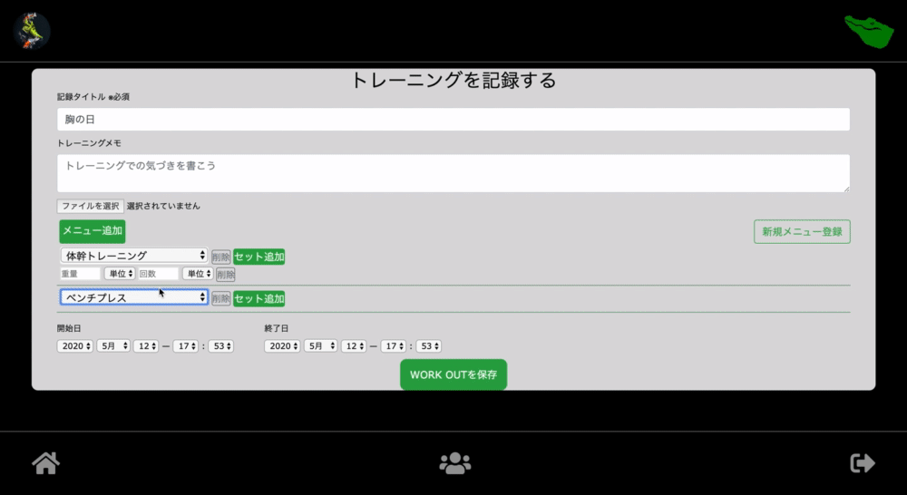
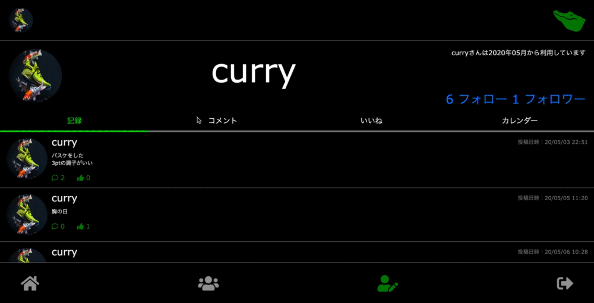

# README
## Name
WON

## Overview
トレーニング記録アプリ

-  トレーニングした内容をTwitterのようなイメージで、記録することができる

-  種目名、重さ、セット数、回数まで記録できる。例えばベンチプレスを100kgを10回、5セットやったという内容を記録できる。

-  トレーニングをマイページでカレンダー管理できる。トレーニングのローテンションを組みやすくする。

- 誰のために
毎日トレーニングを継続する人たち。トレーニングを管理したい人

- 何のために
トレーニングを楽しく、継続するために。記録することで更に楽しくモチベーションを保つアプリ。

## Description
### 機能
-  記録
- カレンダー
- フォロー
- いいね
- コメント

### こだわった点
トレーニングをする上で、カレンダー管理できるツールが無かったので作りました。  
  
カレンダーには、jqueryのfullcalendarを使い実装しました。日本語の文献が少なく、やり方がわからなかったです。  
記録一覧はフォローしたユーザーのみ、カレンダーには自分の記録のみにすることが難しかったです。  
  
トレーニングの記録をする際に、動的にフォームを追加or削除  
記録の中に、メニュー、セットを入れ込む親子孫関係のフォームを作るのに苦戦しました。

## Demo
トレーニングを記録する

カレンダー機能

